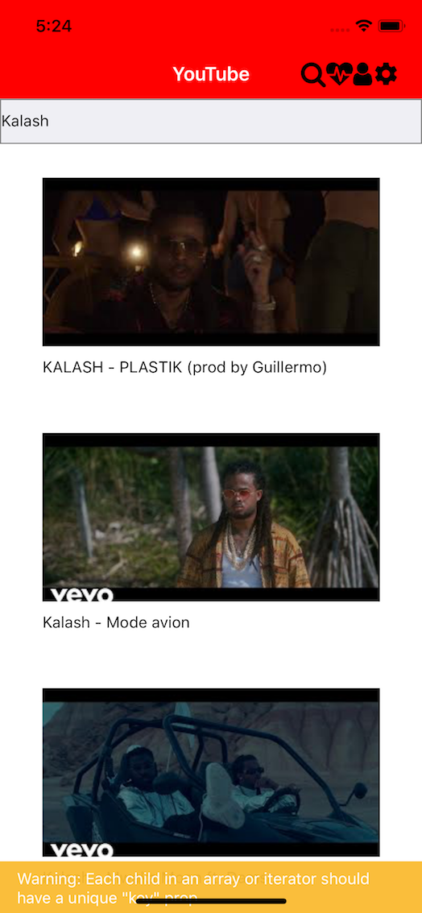

Ceci est un mini projet qui reprends les fonctionnalitées de l'Application YOUTUBE

réalisé en deux jours dans le cadre d'un projet Semi-Encadré par [github du sujet ](https://github.com/makiboto/m.youtube)

## fonctionnalité Technique

* Récupération des Données depuis l'API YOUTUBE
* Recherche d'une video en particulier
* Like d'une Video en laissant appuyer son doigt dessus
* Settings permmettant de visualiser les langues (semi Fonctionnel)

### Acceuil
[]

### recherche d'une video
[]

### verif Like a l'appuie d'une video
[]

###  page des likes
[]
